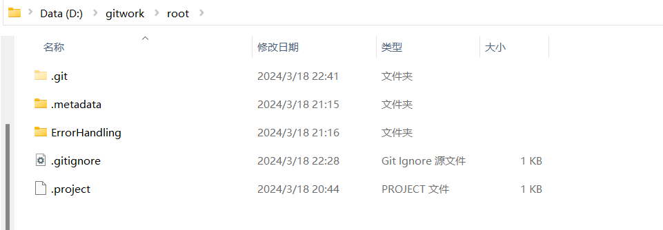

# Report de SE TP1

Author : Sylvie(leader), Olivia(collaborator)

March 18 2024

[the url of the repo](https://github.com/SylivieLing/root)

This is our commit history of our repo with explanation

## Exo 1

### 1. The leader: Create your local repo with "git init” 

We create the local repo with "git init" on the computer of leader(Sylvie).

### 2. Put your repo on Gitee to make this a remote repo

We put our repo on Github.

### 3. Add member

Leader's account add the collaborator(Olivia) on the "Setting" page.

### 4. Set the working directory (workspace) identical to the directory of your local repo

For the leader, just set the workspace identical to the directory of local repo.

For the collaborator, use `git clone` command to import the remote repo.

> The collaborator forgot to take a screenshot for this step.

And set the workspace to the directory of lacal repo.

### 5. Active the Git view in your IDE

## img/exo2: Exception Handling

### 1. Create a new Java project named "Error Handling"

### 2. create a new package named “dividedbyzero”, then create the Main.java file

And run the program.

### 3. The program triggers an Exception.

1. For the leader: Modify the programe with try/catch, use catch (Exception e) to handle the error message and print the error message in the form of `Caught runtime exception = %s\n`.

2. Commit this version and pull it to the remote repository. (with message information : “try/catch block added”)

3. For the collaborator: Once the new version is pushed to the repository, update your local repo with git pull.

4. For the collaborator: specify the exception to be caught by: catch (ArithmeticException e)

Then, commit (with message information: “Exception specified”) and push the new version to the remote repo.

### 4.

In Create a new package named “CallExceptionMethods”. In this package, create a Main.java class.

with follong code.

And complete the commented part in green.

Commit and push the corresponding files to the remote repo with message “img/exo 2”.

